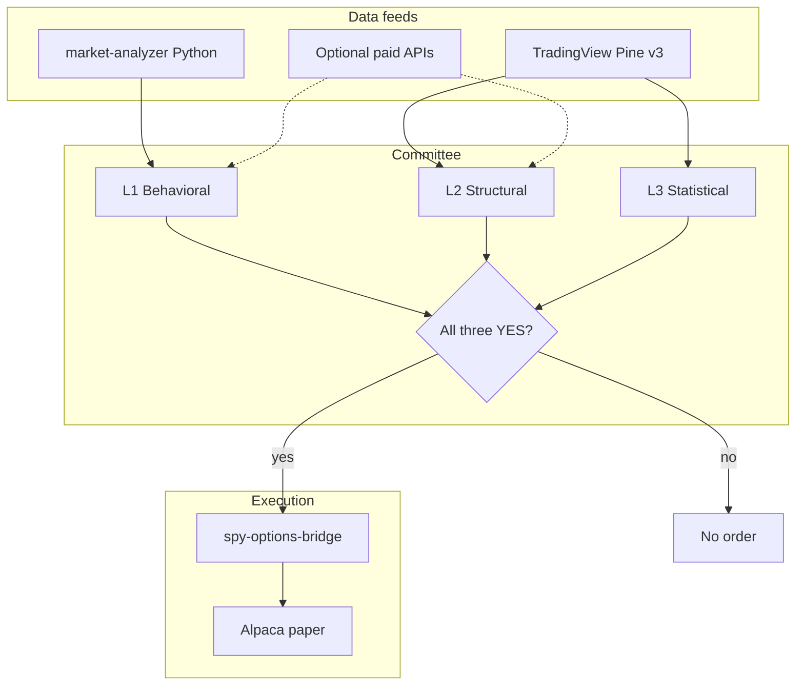

# Workforce Committee Strategy — Architecture (implementation-ready)

## Current production (Phase 0)

- **Pine:** `spy-macd-bridge-signals.pine` → ENTRY / WARNING alerts
- **Bridge:** `spy-options-bridge` v5.5 → `/entry`, `/warning`
- **Validation:** Scenario Lab + exercise scripts

## Target: three-layer unanimous vote



## Pine Script limitations (non-negotiable)

| Requested data | Native TV/Pine | External path |
|----------------|----------------|---------------|
| Dark pool prints | No | Polygon, UW, bridge webhook filter |
| Live options flow | No | Unusual Whales, Cheddar Flow |
| Insider transactions | Limited (symbol-dependent) | Quiver, SEC Edgar via Python |
| Short interest float | Some symbols via `request.financial` | Finnhub, Ortex API |
| IV mean reversion | Proxy via VIX/VIXY only | ORATS, iVolatility |
| Analyst ratings | `request.financial` if available on SPY | Python ingest |

**SPY** is an ETF — fundamental/insider series are weaker than single stocks. L1 must lean on **index proxies** (VIX, HYG/IEF, QQQ ratio) plus Python feeds.

## Layer specifications

### L1 — Behavioral & fundamental (initiator)

**Pine (Phase 1):**

- `request.security("VIX", ...)` regime: elevated → bias caution
- Relative strength: `SPY/QQQ` or `SPY/TLT` trend alignment
- Optional: `request.financial(SPY, "RECOMMENDATION_MEAN")` if non-na

**Python (Phase 3):**

- Extend `market_analyzer.consensus.engine` with `committee_layers.behavioral_ok`
- Inputs: guru composite, RSS high-impact count, Finnhub headlines

**Vote:** `behavioral_ok = composite >= 0.55` (configurable in `committee.yaml`)

### L2 — Structural volume (gatekeeper)

**Pine:**

- `volZ = (volume - ta.sma(volume,20)) / ta.stdev(volume,20)`
- `structural_ok = volZ > 2.0` OR close breaks VAH (volume profile approximation via `ta.vwap` bands)
- Block when `volZ < 0.5` (dead tape)

**Python:**

- Bar burst detector on 1m/5m SPY from Alpaca
- Optional: ingest dark-pool API → `structural_ok` override

### L3 — Statistical execution (timing)

**Pine:**

- ATR squeeze: `ta.atr(14) < ta.percentile_linear_interpolation(ta.atr(14), 100, 20, 10)` then expansion
- **AND** `ta.crossover(macd, signal)` (keep proven trigger)
- RS filter: `SPY` outperforming `QQQ` on 5m ROC

**Python:**

- IV proxy mean-reversion score from VIXY + realized vol

### Voting rule

```text
committee_ok = behavioral_ok and structural_ok and statistical_ok
entry_fire = committee_ok and entryCrossUp  // MACD cross only inside committee
```

Alert JSON:

```json
{
  "committeePass": true,
  "sizeMultiplier": 0.5,
  "layerBehavioral": true,
  "layerStructural": true,
  "layerStatistical": true,
  "macroVolHigh": true
}
```

Bridge (Phase 2): reject if `committeePass !== true`; `qty = max(1, floor(quantity * sizeMultiplier))`.

### Dynamic 50% size

```text
macroVolHigh = vix > ta.sma(vix,20) * 1.15  // Pine proxy
sizeMultiplier = macroVolHigh and committee_ok ? 0.5 : 1.0
```

## API integration candidates (approve before purchase)

| Service | Layer | Est. use |
|---------|-------|----------|
| Unusual Whales / FlowAlgo | L2 options flow | Real-time sweep filter |
| Polygon.io | L2 dark pool | Off-exchange prints |
| ORATS | L3 IV rank | Spread entry timing |
| Quiver Quant | L1 insider/congress | Smart-money bias |
| Finnhub | L1 news | Already optional in analyzer |
| RavenPack | L1 sentiment | Institutional NLP |

## New endpoints (Phase 2–3)

| Endpoint | Purpose |
|----------|---------|
| `GET /committee/SPY` | Latest Python committee state |
| `POST /entry` | Requires `committeePass` when `COMMITTEE_MODE=strict` |

## File plan

| File | Phase |
|------|-------|
| `templates/spy-workforce-committee-v3.pine` | 1 |
| `templates/tradingview-entry-committee.json` | 1 |
| `config/committee.yaml` | 1 |
| `main.py` committee gate | 2 |
| `market-analyzer/scripts/committee_poll.py` | 3 |
| `config/committee_feeds.yaml` | 3 |

## Testing

- Scenario Lab add scenario S9: entry with `committeePass: false` → expect reject
- Scenario Lab S10: all layers true → fill